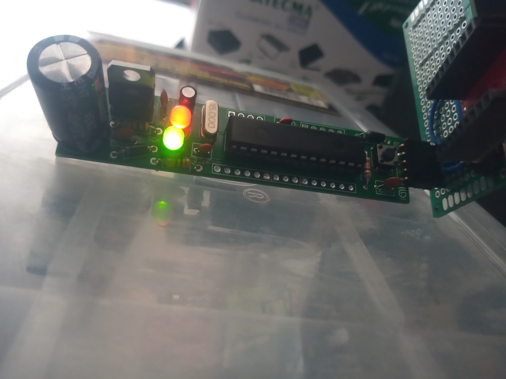
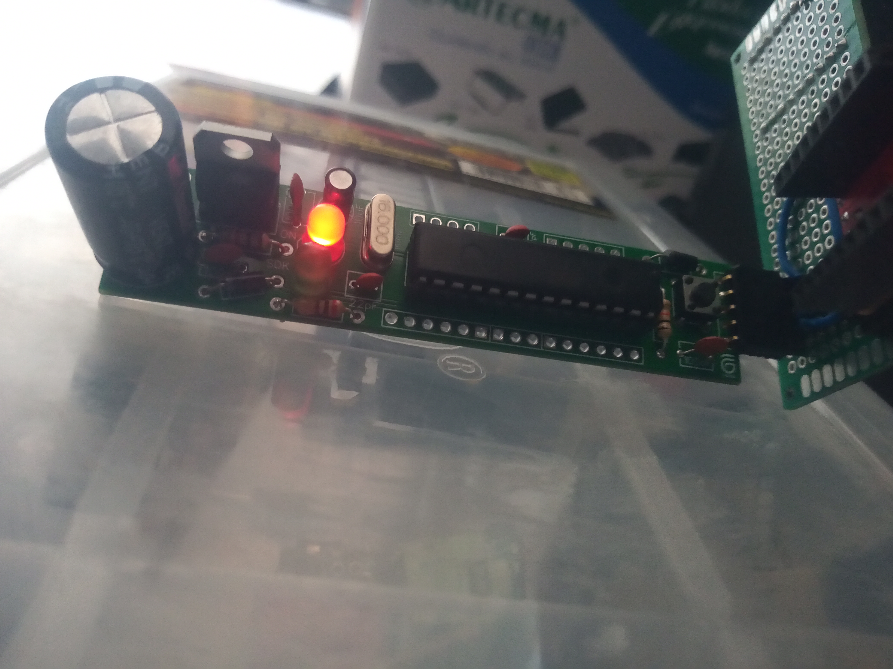

# eSmall

Mini PCB para microcontroladores ATMEGA328P-U
Compatible desde 7v hasta 30v (comprobado).

Compatible con tarjetas Arduino y/o Genuino al igual que con el IDE de Arduino (Requiere FTDI para subir codigo).

